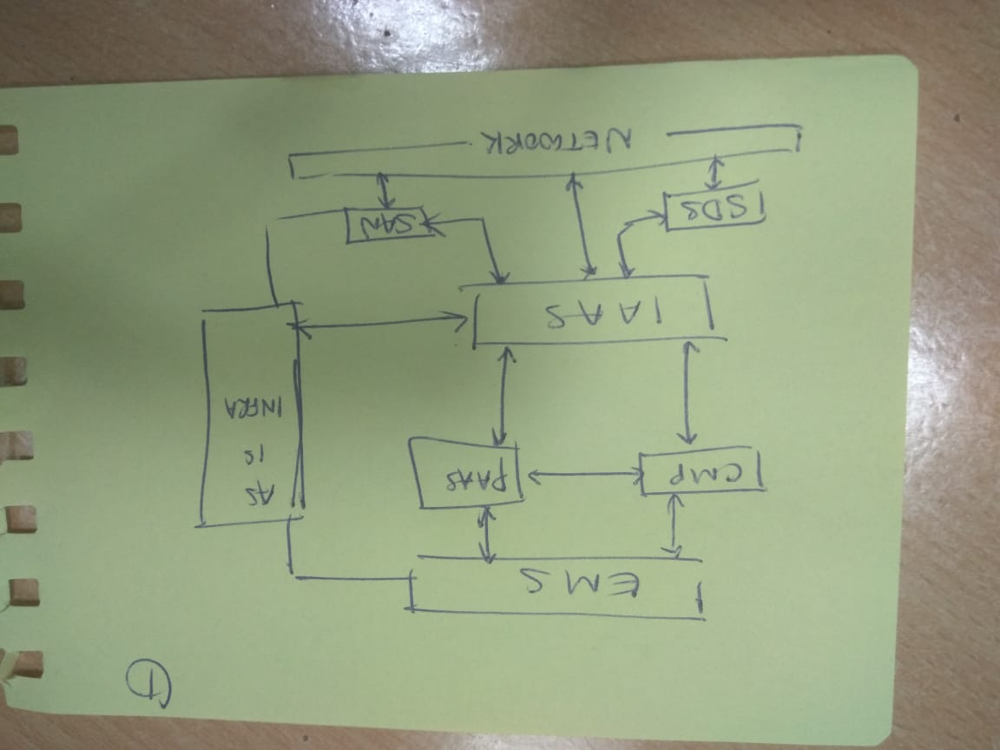
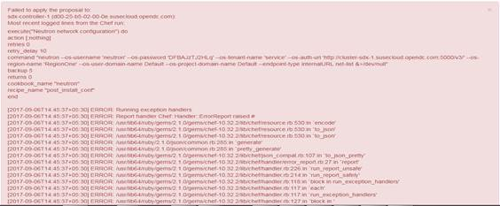
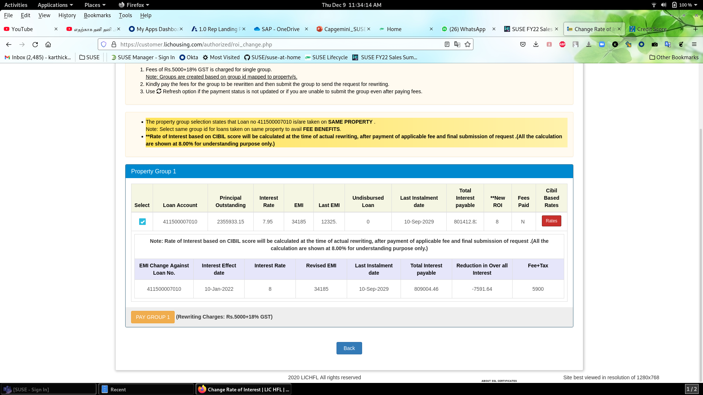
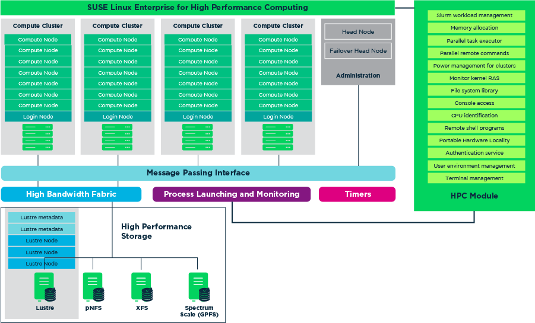

Kubewarden is a Kubernetes Dynamic Admission Controller that validates incoming requests using policies written in WebAssembly. 


`kubectl apply -f https://github.com/jetstack/cert-manager/releases/latest/download/cert-manager.yaml`




```
apiVersion: policies.kubewarden.io/v1alpha2
kind: PolicyServer
metadata:
  name: reserved-instance-for-tenant-a
spec:
  image: ghcr.io/kubewarden/policy-server:v0.3.0
  replicas: 2
  serviceAccountName: ~
  env:
  - name: KUBEWARDEN_LOG_LEVEL
    value: debug
```










