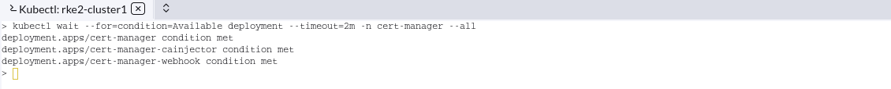
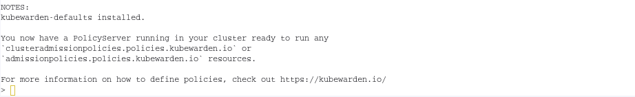
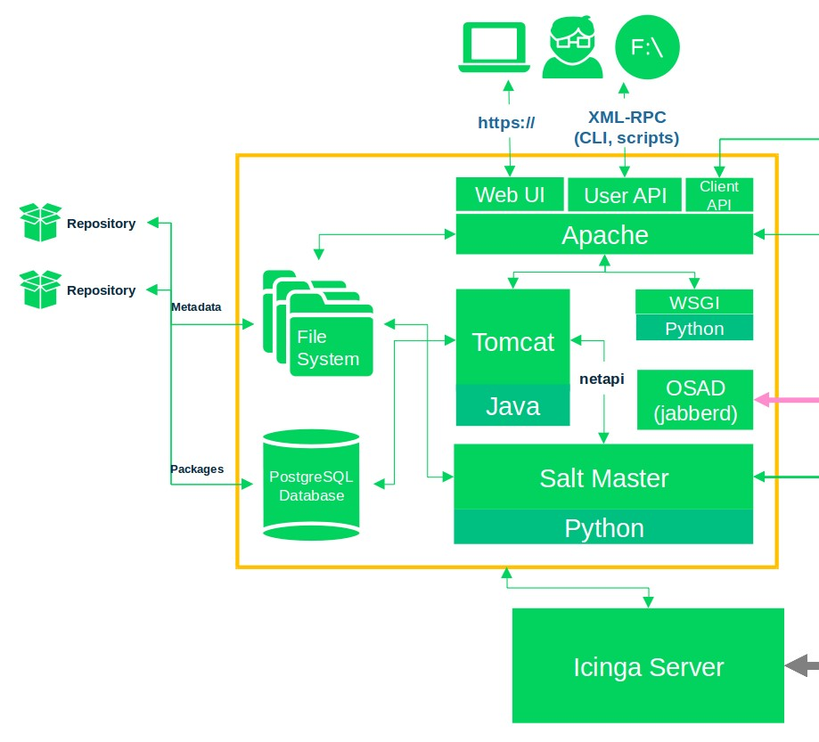
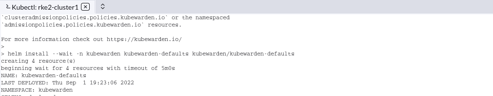

# `LAB`-03A - Install Kubewarden 


In this exercise we will add helm chart and install kubewarden . The Kubewarden stack is made of the following components:

- An arbitrary number of `ClusterAdmissionPolicy` resources: this is how policies are defined inside Kubernetes
- An arbitrary number of `PolicyServer` resources: this component represents a Deployment of a Kubewarden `PolicyServer`. The policies defined by the administrators are loaded and evaluated by the Kubewarden `PolicyServer`
- A Deployment of `kubewarden-controller`: this is the controller that monitors the `ClusterAdmissionPolicy` resources and interacts with the Kubewarden `PolicyServer` components

In order to create Policies we will have to install kubewarden-crds , kubewarden-controller and kubewarden-defaults 

### Step 3A.1 ) Installation of Cert-manager

Kubewarden chart depends on cert-manager . Since it is a dependency we will have to first install cert-manager . 

To Install latest version of `cert-manager`, on Rancher server UI click on left most corner near Rancher logo ->Home -> rke2-cluster1 -> Kubectl icon   


Run below commands in Kubectl shell  :

```
kubectl apply -f https://github.com/jetstack/cert-manager/releases/latest/download/cert-manager.yaml
```

You should see an output similar to below screen-shot , 


```
kubectl wait --for=condition=Available deployment --timeout=2m -n cert-manager --all
```

You should see an output similar to below screen-shot , 



 

### Step 3A.2 ) Deploy Kubewarden stack 

The following charts should be installed inside the `kubewarden` namespace in your Kubernetes cluster:

- `kubewarden-crds`, which will register the `ClusterAdmissionPolicy` and `PolicyServer` Custom Resource Definitions
- `kubewarden-controller`, which will install the Kubewarden controller
- `kubewarden-defaults`, which will create a `PolicyServer` resource named `default`. It can also installs a set of recommended policies to secure your cluster by enforcing some well known best practices

Open Kubectl shell . Add kubewarden helm chart using below command ,

```console
helm repo add kubewarden https://charts.kubewarden.io
```

Now Kubewarden stack can be deployed from above helm chart ,

```
helm install --wait -n kubewarden --create-namespace kubewarden-crds kubewarden/kubewarden-crds

helm install --wait -n kubewarden kubewarden-controller kubewarden/kubewarden-controller

helm install --wait -n kubewarden kubewarden-defaults kubewarden/kubewarden-defaults


```

You should see an output similar to below screen-shot , 




Now we have deployed Kubewarden stack . 


**End of Exercise 1A** 

Continue to: 

[]: /home/karthick/Documents/GitHub/rancher-opa-neuvector-kubewarden-workshop/Exercise-03B-ConfigurePolicyServerandClusterAdmissionPolicy.md	"Exercise-03B-ConfigurePolicyserverandClusterAdmissionPolicy"



.png)


