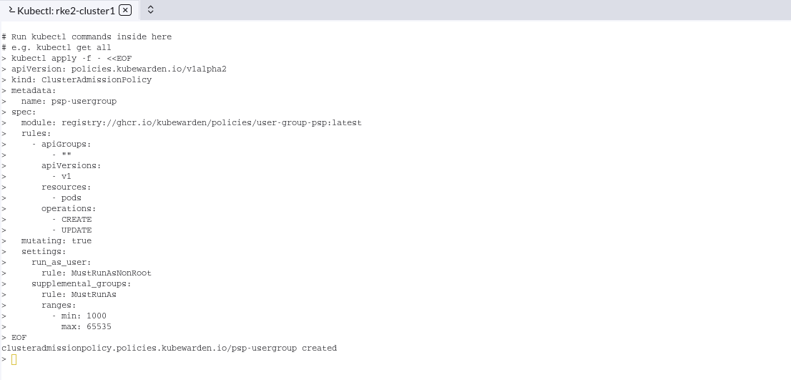
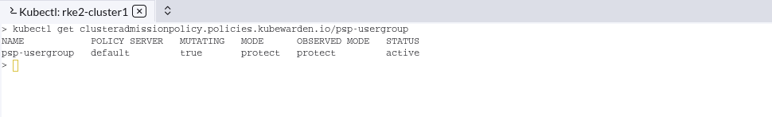

# Exercise-03C - Example ClusterAdmissionPolicies

Once you have the Kubewarden instance running, it's time to deploy some policies to replace the `PodSecurityPolicy` object . Let's create our  first Kubewarden policies . For this first example, we will use the  [user-group-psp policy](https://github.com/kubewarden/user-group-psp-policy)

 Our goal will be to prevent the pods running as root on our Kubernetes cluster by enforcing this policy.

Let's define a `ClusterAdmissionPolicy` for that:

## 03C -1 ) Example 1: Blocking pods running as root

Let's start with blocking pods running as root . For that you can deploy a policy as shown below , by copy paste below policy in kubectl shell ,

```
kubectl apply -f - <<EOF
apiVersion: policies.kubewarden.io/v1alpha2
kind: ClusterAdmissionPolicy
metadata:
  name: psp-usergroup
spec:
  module: registry://ghcr.io/kubewarden/policies/user-group-psp:latest
  rules:
    - apiGroups:
        - ""
      apiVersions:
        - v1
      resources:
        - pods
      operations:
        - CREATE
        - UPDATE
  mutating: true
  settings:
    run_as_user:
      rule: MustRunAsNonRoot
    supplemental_groups:
      rule: MustRunAs
      ranges:
        - min: 1000
          max: 65535
EOF

```

Notice the policy is configured as `mutation: true`. This is required because the policy will add [supplementalGroups](https://kubernetes.io/docs/concepts/security/pod-security-policy/#users-and-groups) when the user does not define them.

This will produce the following output:



When a  `ClusterAdmissionPolicy` is defined, the status is set to `pending`, and it will force a rollout of the targeted `PolicyServer`. You can monitor the rollout by running the following command:

```
kubectl get clusteradmissionpolicy.policies.kubewarden.io/psp-usergroup
```



The `ClusterAdmissionPolicy` status will be set to active once the deployment is done for every `PolicyServer` instance. 

You can test the policy now . Copy paste below section on kubectl shell . Users should not be able to deploy pods running as root:

```
kubectl apply -f - <<EOF
apiVersion: v1
kind: Pod
metadata:
  name: nginx
spec:
  containers:
  - name: nginx
    image: nginx
    securityContext:
      runAsNonRoot: false
      runAsUser: 0
EOF

```

```
Error from server: error when creating "STDIN": admission webhook "clusterwide-psp-usergroup-fb836.kubewarden.admission" denied the request: RunAsNonRoot should be set to true
```

You can see the Error states the pods cannot be deployed since the Kubewarden policy denied the request to run as root user . Let us see another example where the  parameter is set`runAsNonRoot: true`  but still denied  because the user ID is still pointing to root ie , UID 0 

```
kubectl apply -f - <<EOF
apiVersion: v1
kind: Pod
metadata:
  name: nginx
spec:
  containers:
  - name: nginx
    image: nginx
    securityContext:
      runAsNonRoot: true
      runAsUser: 0
EOF
```

```
Error from server: error when creating "STDIN": admission webhook "clusterwide-psp-usergroup-fb836.kubewarden.admission" denied the request: Invalid user ID: cannot run container with root ID (0)
```


## 03C -2 ) Example 2: Allowing pod to use the port 443 only

To replace the PSP configuration that blocks privileged containers, it's necessary to deploy the [Host Namespaces PSP](https://github.com/kubewarden/host-namespaces-psp-policy). This policy does not require any settings. Once running, it will block users to use ports other than 443 and ports between 5000 - 6000 . 


```
kubectl apply -f - <<EOF
apiVersion: policies.kubewarden.io/v1alpha2
kind: ClusterAdmissionPolicy
metadata:
  name: psp-hostnamespaces
spec:
  module: registry://ghcr.io/kubewarden/policies/host-namespaces-psp:v0.1.2
  rules:
    - apiGroups:
        - ""
      apiVersions:
        - v1
      resources:
        - pods
      operations:
        - CREATE
        - UPDATE
  mutating: false
  settings:
    allow_host_ipc: false
    allow_host_pid: false
    allow_host_ports:
      - min: 5000
        max: 6000
      - min: 443
        max: 443
    allow_host_network: false
EOF
```

Now the policy is created and enforced . The pod should be only able to expose the ports between 5000 and 6000 and port 443 . It should throw an  error when other port numbers are configured against the hostPort  section.

```
kubectl apply -f - <<EOF
apiVersion: v1
kind: Pod
metadata:
  name: nginx
spec:
  containers:
  - name: nginx
    image: nginx
    imagePullPolicy: IfNotPresent
    ports:
      - containerPort: 80
        hostPort: 80
  - name: sleeping-sidecar
    image: alpine
    command: ["sleep", "1h"]
EOF

```

```
Error from server: error when creating "STDIN": admission webhook "clusterwide-psp-hostnamespaces.kubewarden.admission" denied the request: Pod is using unallowed host ports in containers
```

Above example should work if 443 or a port range between 5000 to 6000 is used  . 

**End of Exercise 03C .** 
