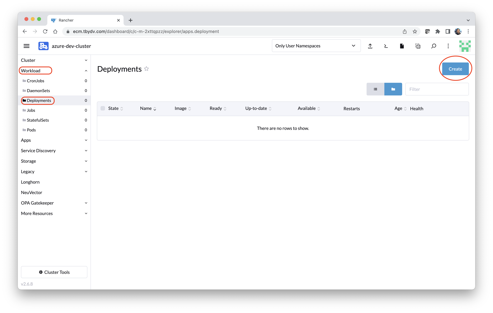
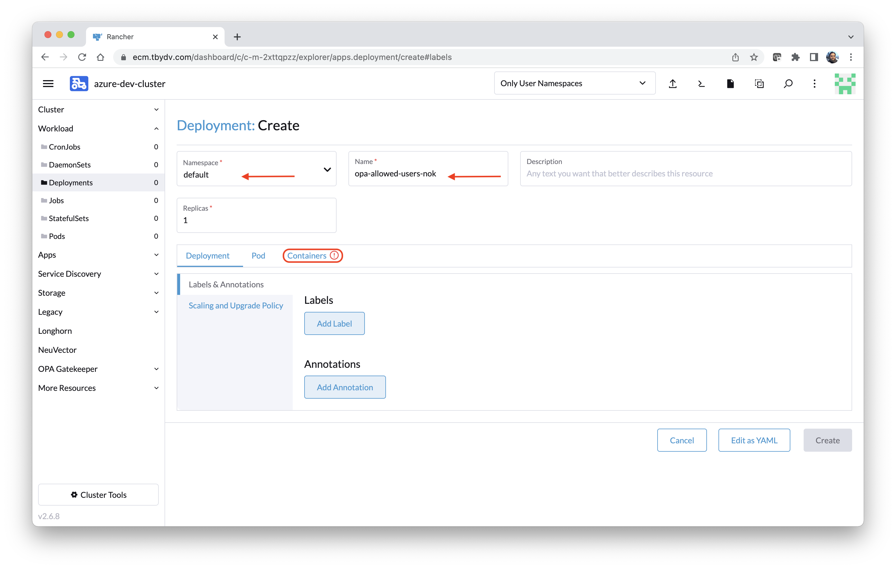
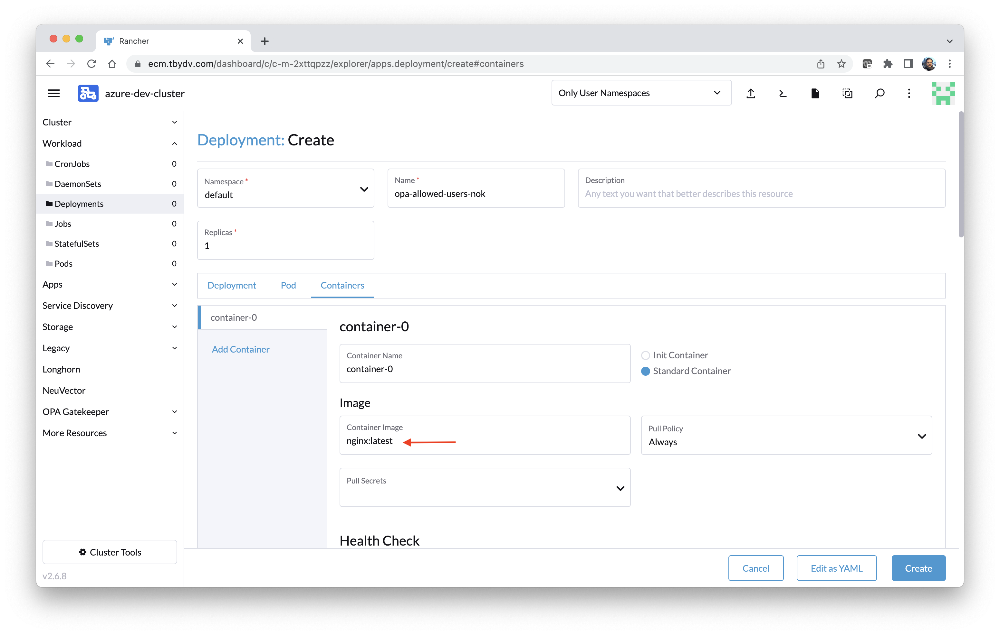
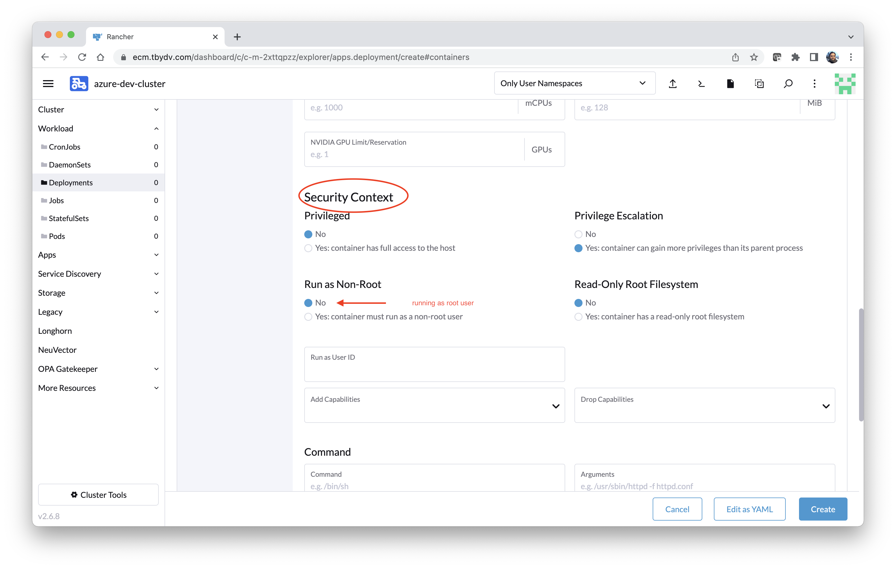
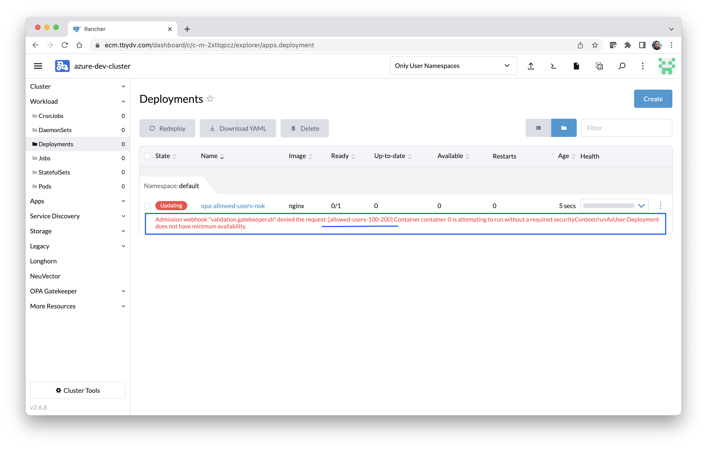
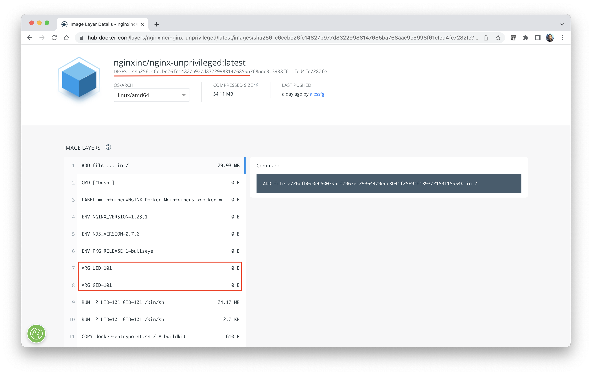
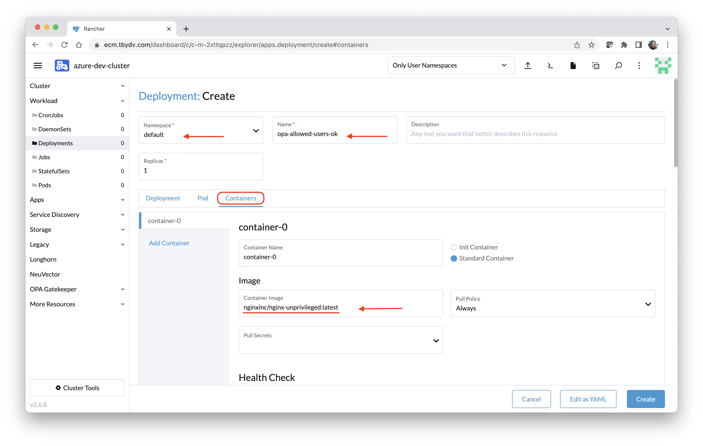
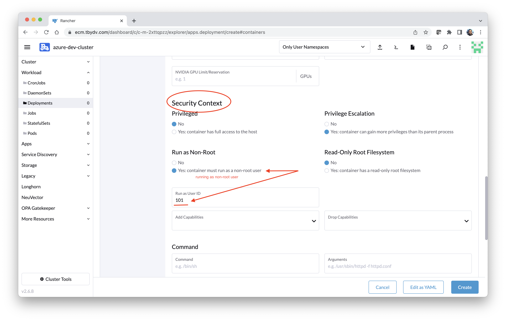
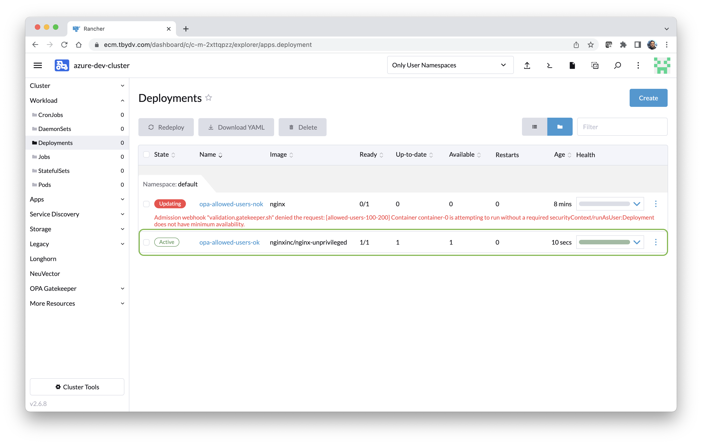
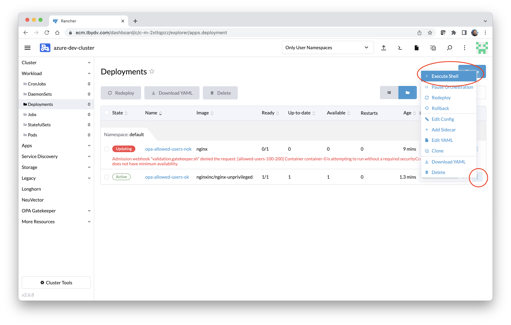

# Lab 1 B - Test container runAs non-root user as per the OPA constraint setup (user 100 - 200) 

This exercise will continue from the previous Exercise 1A. We'll deploy a sample container `nginx:latest` running as root user (0) and nginxinc/nginx-unpriveleged:latest running as non-root user (101) respectively to validate OPA Constraint.  

###### Usecase: It's now time to test and ensure that policies are working as we are expecting! 

## Action 1: Validate constraint - careating container runAs root user. 

This action will involve 3 steps from 1B.1 to 1B.3

**Step 1B.1)** Make sure that you are at the Deployment screen in Rancher. Click on `Create`.

**Step 1B.2)** Fill in following details

`Namespace : default`

`Name : user's choice e.g. opa-allowed-users-nok`

**Step 1B.3)** Now navigate to the `Containers` tab. 

`Container Image : nginx:latest`

**Step 1B.4)** Now scroll down and stop at `Security Context` to ensure the default value of `Run as Non-Root` to `No` means container will run as root user. 

**Step 1B.5)** Click `Create` and verify that OPA constraint is stopping you to create the deployment. 

**End of Action 1**

## Action 2: Validate deployment - careating container runAs non-root user. 

This action will involve 6 steps from 1B.6 to 1B.11

**Step 1B.6)** That's Good! Now let us see if the container runs with non-root user e.g. 101 which is within the specified range. We have to use one such container which is build to run as non-root e.g. `nginxinc/nginx-unprivileged:latest`. 

**Step 1B.7)** Create a fresh deployment with following details. 

`Namespace : default`

`Name : user's choice e.g. opa-allowed-users-ok`

Now navigate to the `Containers` tab. 

`Container Image : nginxinc/nginx-unprivileged:latest`

**Step 1B.8)** Now scroll down and stop at `Security Context` to change the default value of `Run as Non-Root` to `Yes` means container will run as non-root user. Also specify the value of field `Run as UserID`  to `101`. 

**Step 1B.9)** Now click `Create` and verify that deployment is created successfully. 

**Step 1B.10)** Let's validate if the container is really running as non-root user i.e. 101. Click on the 3 vertical dots menu at the right end of the new created deployment and click on ` > Execute Shell`. It will open an inline window just below the Deployment section. 

**Step 1B.11)** Execute command `id` in the shell and verify that `uid`, `gid`, and `groups` values are 101 as specified in the container. 

Bingo! The OPA constraint is working as we were expecting. But wait... How much you are familiar with REGO language and how much effort it will require to create an OPA template if you are relatively newer in this space? Definitely, there are readymade templates available on git [gatekeepr-library](https://github.com/open-policy-agent/gatekeeper-library) which you may explore. However, there are good alternatives for advance policy control like `ARP Spoofing` etc. Let's conclude it here the and move on to the next exercise which will guide you more in-depth. 

**End of Action 2**

**End of Exercise 1B**

Continue to: [Exercise 2A-Kubewarden](/docs/Lab02-Kubewarden.md)
