# Lab-02 - Kubewarden - ClusterAdmissionPolicy  


Kubewarden is a policy engine for Kubernetes. Its mission is to simplify the adoption of policy-as-code . Since PodSecurityPolicy (PSP) is being deprecated in Kubernetes 1.21, you can use Kubewarden as a replacement to PSP policies . 


In this lab we will be performing following tasks, 

Task 1 : Install Kubewarden

Task 2 : Deploy a sample pod and check NET_RAW capabilities is inherited by default

Task 3 : Enforce Admission control policy to disallow NET_RAW capability for any pods in the default namespace

Task 4 : Redeploy the same sample pod and check NET_RAW capabilities is not available anymore in that pod.


## Task 1 : Install Kubewarden

In this exercise we will add helm chart and install kubewarden. The Kubewarden stack is made of the following components:

- An arbitrary number of `ClusterAdmissionPolicy` resources: this is how policies are defined inside Kubernetes
- An arbitrary number of `PolicyServer` resources: this component represents a Deployment of a Kubewarden `PolicyServer`. The policies defined by the administrators are loaded and evaluated by the Kubewarden `PolicyServer`
- A Deployment of `kubewarden-controller`: this is the controller that monitors the `ClusterAdmissionPolicy` resources and interacts with the Kubewarden `PolicyServer` components

In order to create Policies we will have to install kubewarden-crds , kubewarden-controller and kubewarden-defaults 

#### Step 1 ) Installation of Cert-manager

Kubewarden chart depends on cert-manager . Since it is a dependency we will have to first install cert-manager . 

To Install latest version of `cert-manager`, 

1. Login to your Rancher Server instance with your given credential. 

2. From the left-side menu, click the downstream cluster `rke2-cluster` to get into the **Cluster Explorer** page.

   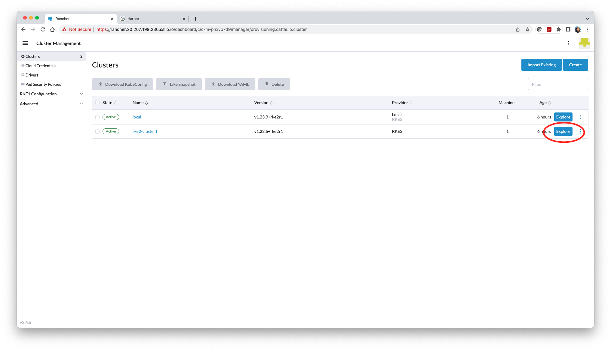

3. At this **Cluster Explorer** page, at the top icon menu bar. click the "> _" icon to open the web-based terminal shell.

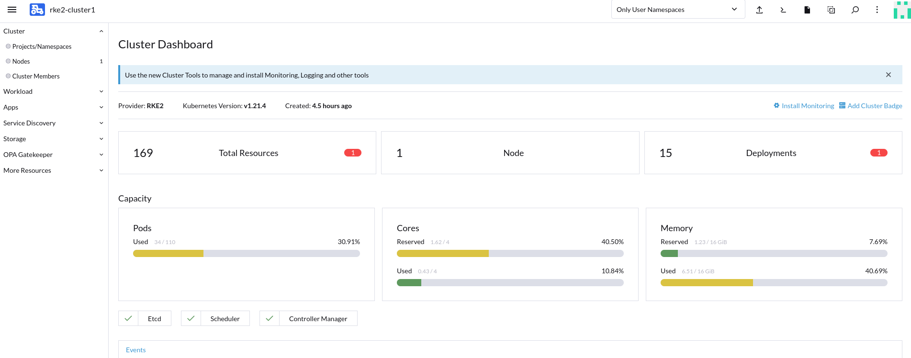

Run below commands in Kubectl shell  :

```
kubectl apply -f https://github.com/jetstack/cert-manager/releases/latest/download/cert-manager.yaml
```

You should see an output similar to below screen-shot , 

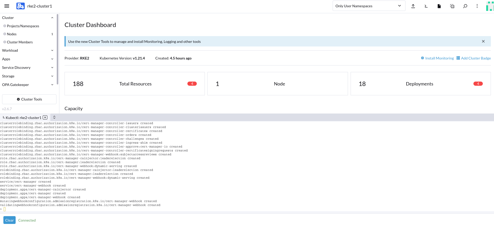

Now we have successfully deployed Certmanager in our cluster . The next step would be to install kubewarden stack .  

#### Step 2 ) Deploy Kubewarden stack 

The following charts should be installed inside the `kubewarden` namespace in your Kubernetes cluster:

- `kubewarden-crds`, which will register the `ClusterAdmissionPolicy` and `PolicyServer` Custom Resource Definitions
- `kubewarden-controller`, which will install the Kubewarden controller
- `kubewarden-defaults`, which will create a `PolicyServer` resource named `default`. It can also installs a set of recommended policies to secure your cluster by enforcing some well known best practices

Open Kubectl shell . Add kubewarden helm chart using below command ,

```console
helm repo add kubewarden https://charts.kubewarden.io
```

Kubewarden stack can be deployed from above helm chart . Copy paste below commands in kubectl shell ,

```bash
helm install --wait -n kubewarden --create-namespace kubewarden-crds kubewarden/kubewarden-crds

helm install --wait -n kubewarden kubewarden-controller kubewarden/kubewarden-controller

helm install --wait -n kubewarden kubewarden-defaults kubewarden/kubewarden-defaults

```

Wait until you see an output similar to below screen-shot , 

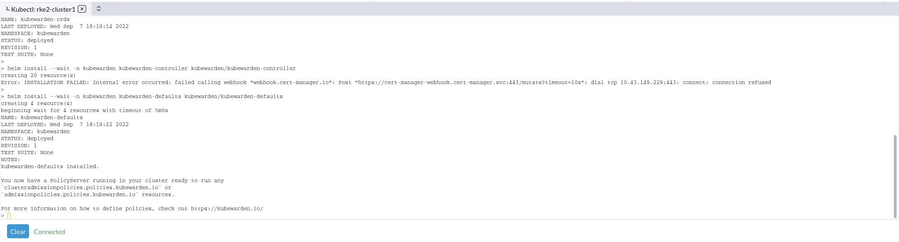


Now we have deployed Kubewarden stack with default policy server . Next step is to deploy a sample pod if the `NET_RAW` capability is inherited by default  .

## Task 2: Deploy a sample pod and check NET_RAW capabilities is inherited by default

Kubernetes by default **connects** all the **containers running in the same node** (even if they belong to different namespaces) down to **Layer 2** (ethernet). This allows a malicious containers to perform an [**ARP spoofing attack**](https://github.com/carlospolop/hacktricks/blob/master/generic-methodologies-and-resources/pentesting-network/#arp-spoofing) to the containers on the same node and capture their traffic. 

In order to avoid such ARP spoofing attack it is important , not to allow `NET_RAW` capability . Let us now create a sample pod without requesting any NET_RAW capability under security context configuration .  Create a manifest file named `bcisle15default.yaml` with below content and save it . 

```yaml
apiVersion: apps/v1
kind: Deployment
metadata:
  name: bci-sle15
  labels:
    app: sle15
spec:
  replicas: 1
  strategy: 
    type: RollingUpdate
  selector:
    matchLabels:
      app: sle15
  template:
    metadata:
      labels:
        app: sle15
    spec:
      containers:
      - name: sle15
        image: registry.suse.com/suse/sle15:latest
        imagePullPolicy: IfNotPresent
        command: ['sh', '-c', 'echo Container 1 is Running ; sleep 3600']
```

Or you can use import yaml option in rancher UI and copy paste above manifest file ,

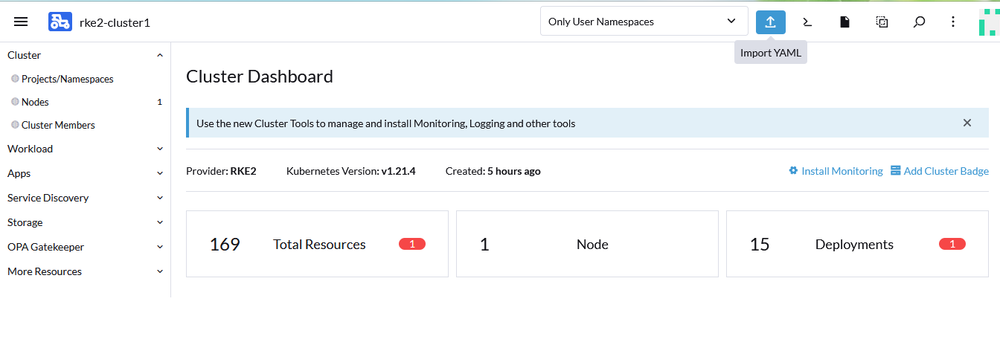

wait until the deployment gets completed . You can verify the pod deployment by navigating through Workload - > Deployments . The bci-sle15 pods should be active as shown below , 


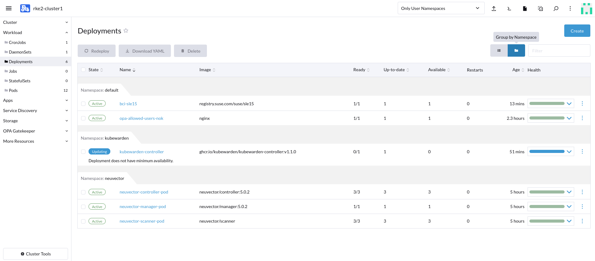


Now execute shell into the bci-sle15  pod by clicking on three dots at corner .

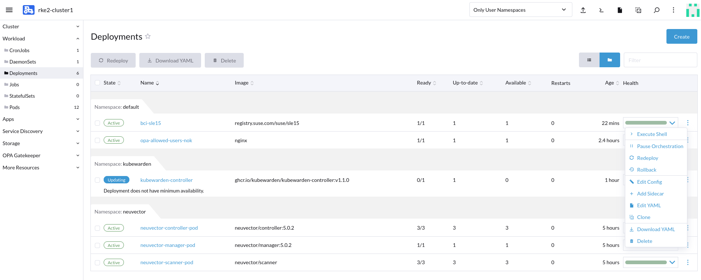

run this command inside bci-sle15's shell to check the inherited linux capabilities:

```bash
zypper install -y libcap-progs
capsh --decode=$( cat /proc/$$/status | grep CapEff | cut -d : -f 2 | xargs ) | GREP_COLOR='01;31' grep --color=auto net_raw
```

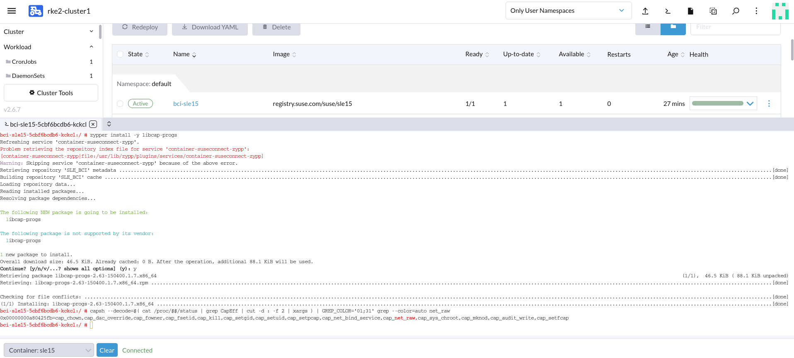

You can see on above output the `CAP_NET_RAW` linux capabilities exists even if the pod manifest does not do anything requesting it in the security context configuration of its deployment. In Task 3 create an admission control policy to drop the `NET_RAW` capabilities so that when a pod is created with `CAP_NET_RAW`  

## Task 3 : Enforce Admission Control Policy to drop NET_RAW capabilities

Once you have the Kubewarden instance running, it is time to deploy some policies to replace the `PodSecurityPolicy` object . The `ClusterAdmissionPolicy` resource is the core of the Kubewarden stack. This resource defines how policies evaluate requests.

Enforcing policies is the most common operation which a Kubernetes administrator  will perform. You can declare as many policies as you want, and each  policy will target one or more specific Kubernetes resources (i.e., `pods`, `Custom Resource`). You will also specify the type of operation(s) that will be applied for the targeted resource(s). The operations available are `CREATE`, `UPDATE`, `DELETE` and `CONNECT`.

 The Kubewarden Policy `psp-capabilities` controls Container Capabilities . In below example you can see `NET_RAW` capability under `required_drop_capabilities` section . These are capabilities which must be dropped from containers and are removed from the default set  . 

Create a yaml file `clusteradmissionpolicy.yaml` with below content and execute the same in kubectl shell or use import YAML option from UI and copy paste below manifest file ,

```yaml
apiVersion: policies.kubewarden.io/v1alpha2
kind: AdmissionPolicy
metadata:
  name: drop-cap-net-raw
  namespace: default
spec:
  policyServer: default
  module: registry://ghcr.io/kubewarden/policies/psp-capabilities:v0.1.7
  rules:
  - apiGroups: [""]
    apiVersions: ["v1"]
    resources:
    - pods
    - deployments
    operations:
    - CREATE
    - UPDATE
  mutating: true
  settings:
    required_drop_capabilities:
    - NET_RAW
```

Once deployed you should see an output similar to below screen-shot under `More Resources -> policies.kubewarden.io -> AdmissionPolicies ,` 

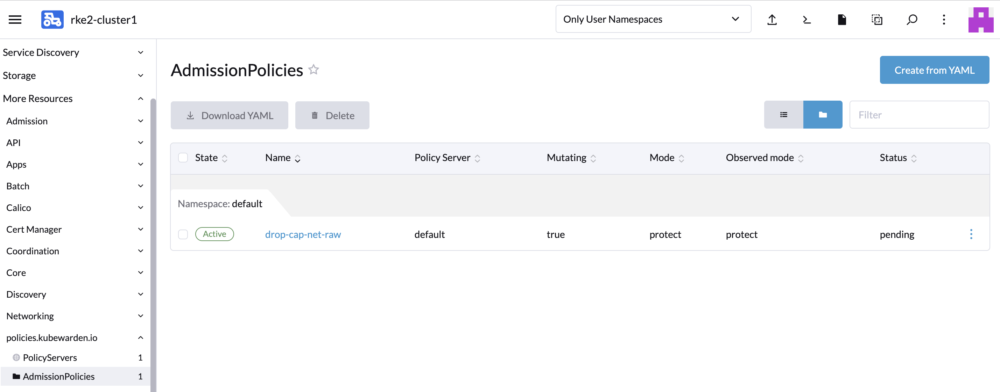

Now that the policy is enforced let us redeploy the sample pod with `NET_RAW` capability , which should be denied by drop-cap-net-raw policy .


## Task 4 : Redeploy the same sample pod and check NET_RAW capabilities is not available anymore in that pod.

Now Redeploy the sample pod `bci-sle15` by clicking on the three dots on right corner of `bci-sle15` pod under `Workload - > Deployments` 

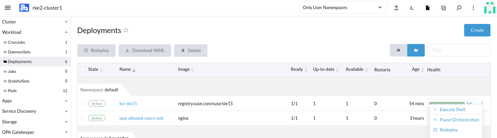


Click on Execute shell into the redeployed pod and run below command to check the inherited linux capabilities:

```bash
zypper install -y libcap-progs
capsh --decode=$( cat /proc/$$/status | grep CapEff | cut -d : -f 2 | xargs )
```

You can see an output similar to below screenshot . You can see the `NET_RAW` capabilities is gone/dropped in the pod, because of the enforcement by the admission policy in Kubewarden)

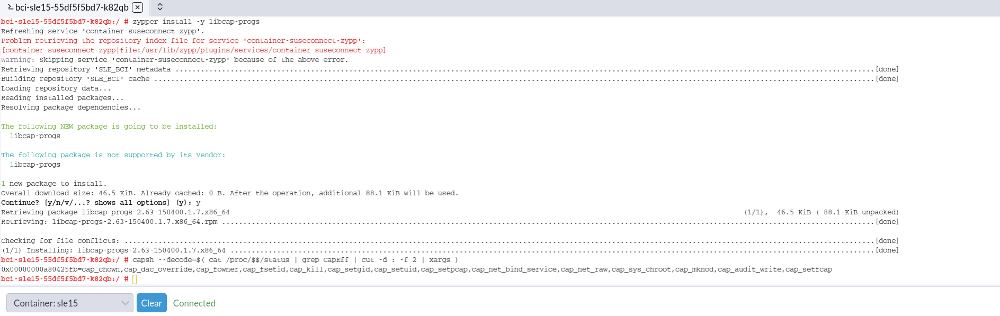


**End of Lab02-Kubewarden** . Once you have completed the lab kindly remove drop-cap-net-raw policy under `More Resources -> policies.kubewarden.io -> AdmissionPolicies` as below , 

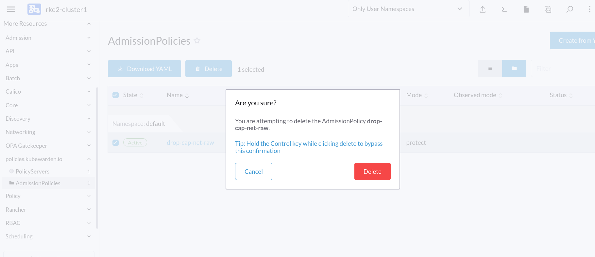

Confirm and delete the drop-cap-net-raw policy . 

Continue to: [Lab03-NeuVector-Admission Control](https://github.com/dsohk/rancher-opa-neuvector-kubewarden-workshop/blob/main/docs/Lab03-NeuVector-Admission-Control.md)

