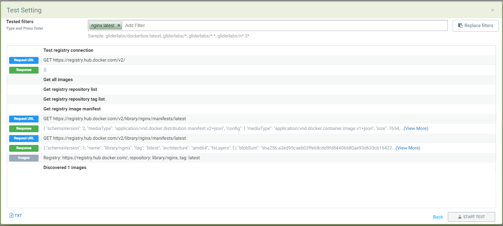
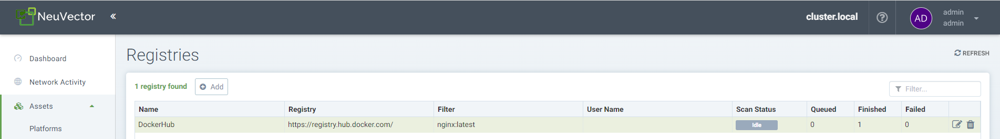
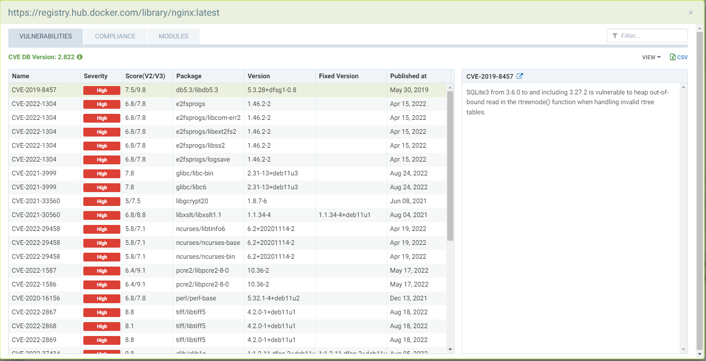
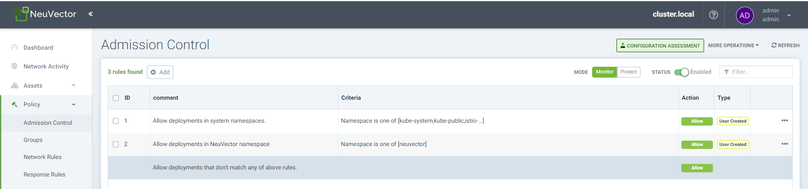
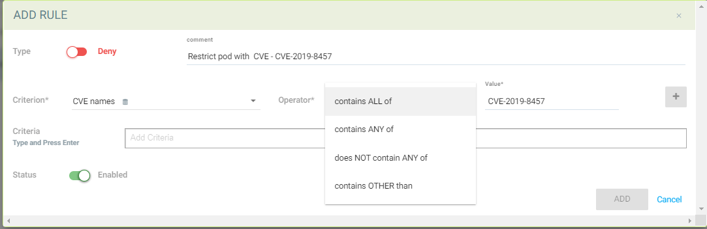
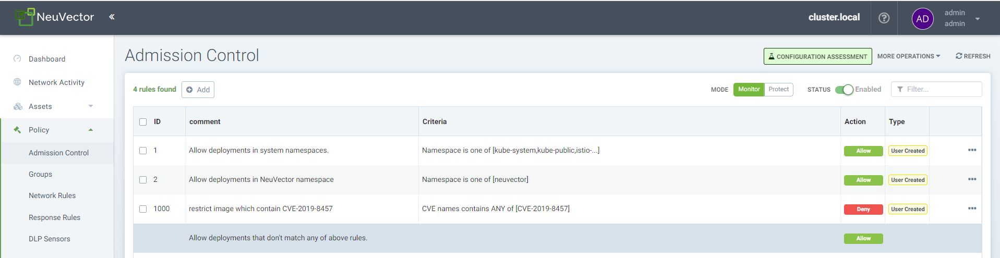
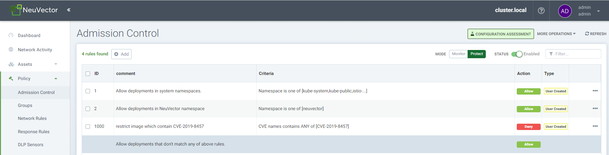
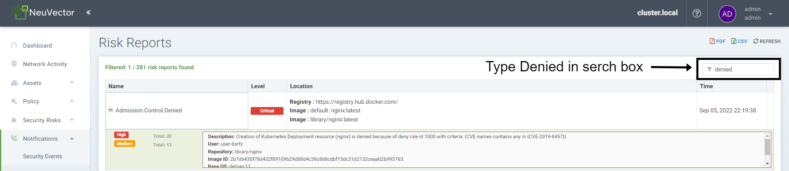

# Lab-03- NeuVector (Admission Control) 

## Background 

In previous workshop on Private Registry with Rancher, we have shown you the capability of Open Policy Agent (OPA).

GitHub link for Workshop 'https://github.com/dsohk/rancher-private-registry-workshop'

OPA provides Policy-based control for cloud native environments. It provides flexible, fine-grained control for administrators. OPA uses Rego language to build its policies. You need to have good knowledge and skill on using Rego while you want to take advantage of OPA.  

But what if you don't have skilled and experience on Rego.  What if you want UI to reduce your learning curve. SUSE NeuVector is an possible solution you can look at. 

SUSE NeuVector is your Zero Trust Container Security Platform. 

In this lab exercise, we will create Admission Control Policy using NeuVector. Our intention is to prevent 'NGINX' image with high Severity Score to prevent running within our cluster. 

In this exercise we will be performing 3 tasks as below

- Task 1 - Adding Container Registry to NeuVector Asset list
- Task 2 - Creating NeuVector Admission Policy.   
- Task 3 - Validate NeuVector Admission Control Policy.  

-----------------------------------------------------------------------------------------------------------------------------------------------------------------------------------

## Task 1 - Adding Container Registry to NeuVector Asset list

In this task will be adding Container Registry to NeuVector. Once the assets are added NeuVector databased, NeuVector than uses it for it operation. 

**Step 1)** 

You will be provided with Rancher and NeuVector URL. Please open the file with your favourite editor. 

Copy and paste the NeuVector URL in your browser. 

You will be promoted for username & credentials. Supply the credentials & login.

username = 'admin'

password = 'admin'

Upon successful login, you will be prompted to accept the end user license agreement. Please accept & proceed. 

You will be presented with NeuVector Dashboard. 

Before we proceed, we will change the session timeout to higher value to avoid frequent re-login. 

Click on Admin (Right Hand Corner) > My Profile > Edit my profile > Session Timeout > Change current value to 3600. (Present value would be 300). You may be prompted to re-login.

**Step 2)**

NeuVector Dashboard > Assets > Registries  > Add Registries. 

Name = 'DockerHub'

Registry URL = 'https://registry.hub.docker.com'

Filter = 'nginx:latest' & click Tab. Your filter will be added to the filter list.

Optionally if you want you can toggle the Scan Layer & Periodic Scan based on your requirement. 

**Step 3)**

Click on 'Test Setting' it will open a pop up window. Result will return with Image discovery. We can than click 'back' to return to NeuVector 

Above result shows success. You can click on back button & than click on 'Submit'. Start Scan to scan the image in the registry.

Click on the 'nginx:latest' and it will open up the scan result as below. 

We now have the CVE which we wanted to use. 

CVE = 'CVE-2019-8457', Severity = 'High' and Score = '7.5/9.8' 

------------

## Task 2 - Creating NeuVector Admission Policy.   

In this task we will create the new admission control policy to restrict container image with certain CVE Numbers. 

**Step 1)** 

NeuVector Dashboard > Policy > Admission Control.

Toggle the status bar to enable Admission Control. 

Be default, you will be in Mode 'Monitor'.

**Step 2)** 

Next step is to create the add/create a new Admission Control Policy. A form will be presented to you. Post entering details as below, click on '+' symbol

Criterion = 'CVE Names'

Operator = 'Container All off ' or 'Contain Any of'

Value = 'CVE-2019-8457'

Upon clicking 'Add" your new policy with ID '1000 ' is created.

**Step 3)**  

Next step is to toggle the Mode to 'Protect' which will enforce the policy to restrict the pod with select CVE to run as container in our cluster. 

Navigate to Dashboard > Notification > Events.  

Next step is to test our newly create policy. For this we will need to move to your browser window where you have the Rancher UI.   

## Task 3 - Validate NeuVector Admission Control Policy.  

In this step we will validate NeuVector Admission Control policy we created in the previous step

**Step 1)** 

Rancher UI > Home > Explore Cluster > 'rke2-cluster1' > Workload > Deployments > Create 

Namespace = 'default'

Name = 'nginx'

Container Page > Image = 'nginx:latest' 

Click on 'Create'

We are getting this error as our NeuVector Admission Control in Protect Mode is restricting the image with 'CVE-2019-8457'

If you toggle back to NeuVector page

NeuVector > Dashboard > Notification > Risk Reports > In the Search box on right hand top corner - Type 'Denied'  

We can clearly our risk report providing the details of Admission Control Denying the execution to create the deployment due to the NeuVector Policy. 

So without any knowledge of programming language like Rego, Rust using NeuVector's intuitive UI, we have created a policy to restrict image with CVE not be execute in our cluster. 

**End of Lab03 and Technical Hands-on Workshop as well** 

 

